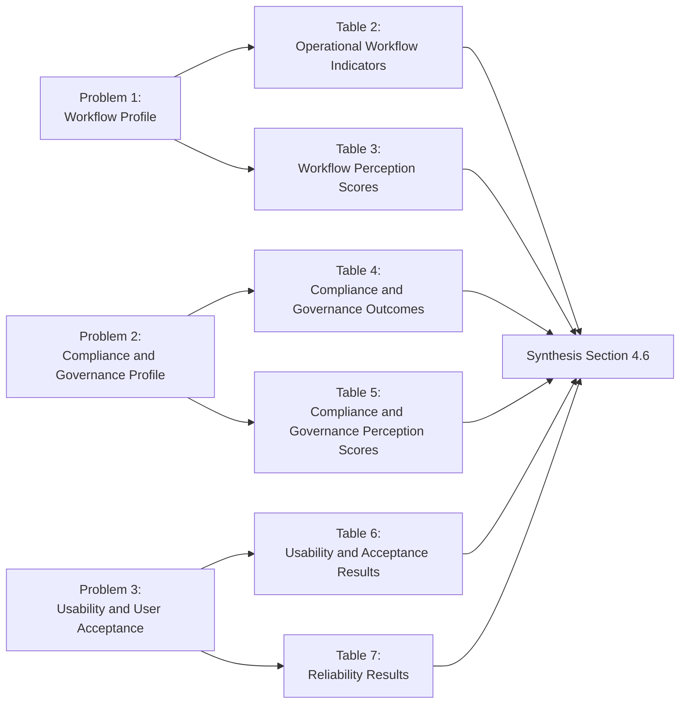

# **RESULTS AND DISCUSSION**

This chapter presents, analyzes, and interprets the post-implementation results of the Faculty Portfolio Management System (FPMS). The presentation follows the research problems in Chapter I and the statistical treatment defined in Chapter III. Results are organized into three main domains: (1) workflow efficiency, (2) compliance and governance support, and (3) usability and user acceptance.

## 4.1 Respondent and Evaluation Profile

The survey-based evaluation included active FPMS users who performed actual system tasks during the evaluation period.

Evaluation window: `2025-11-12 03:59:55` to `2026-03-02 10:05:07`

### Table 1. Respondent Distribution by Role

| Role | n | % |
|---|---:|---:|
| Faculty | 27 | 77.14 |
| Chair/Reviewer | 4 | 11.43 |
| Auditor | 4 | 11.43 |
| **Total** | **35** | **100** |

Interpretation:

- The sample is faculty-dominant, which is expected because faculty users perform the largest share of portfolio submission tasks.
- Chair/reviewer and auditor responses provide role-specific governance and oversight perspectives, but at smaller subgroup sizes.

## 4.2 Results for Problem 1 (Chapter I-Aligned): Post-Implementation Workflow Profile

Chapter I Problem 1 asks: *What is the post-implementation workflow profile of the developed FPMS in terms of process organization, status tracking, available operational indicators from logs, and user-perceived turnaround support?*

Results were derived from both system records (objective indicators) and survey perception measures (WI and RT constructs).

### Table 2. Post-Implementation Workflow Indicators (Operational Records)

| Metric | Value | Unit | Notes |
|---|---:|---|---|
| Total portfolios | 162 | records | Evaluation window dataset |
| Processing duration (mean / median) | 14,582.01 / 4,981.13 | minutes | `created_at` to `submitted_at` for submitted/decided records (`n=29`) |
| Review turnaround (mean / median) | 23,712.91 / 24,785.23 | minutes | `submitted_at` to review decision timestamp (`reviews`, `n=29`) |
| Queue-stage coverage | 29 reviewed / 0 pending | count | submitted portfolios with/without matched review record in extraction |

### Table 3. Workflow Perception Scores

| Construct | Mean | SD | Verbal Interpretation |
|---|---:|---:|---|
| Workflow Improvement (WI) | 4.53 | 0.21 | Highly Acceptable |
| Review Turnaround Support (RT) | 4.53 | 0.17 | Highly Acceptable |
| **Problem 1 Cluster Mean (WI + RT)** | **4.53** | **0.19** | **Highly Acceptable** |

Discussion:

- The WI and RT results indicate strong user agreement that FPMS improved process organization, status visibility, and coordination.
- Objective review turnaround is now measurable from 29 review records. The high elapsed values should be interpreted as workflow-stage timing under real operational workload, not as isolated interface response time.
- The system already supports measurable workflow monitoring through status and timestamp fields, while fuller governance validation still requires populated action-level audit logs.

## 4.3 Results for Problem 2 (Chapter I-Aligned): Post-Implementation Compliance and Governance Profile

Chapter I Problem 2 asks: *What is the post-implementation compliance and governance profile of the developed FPMS in terms of required-document completeness, role-based governance, and available traceability/report-readiness indicators?*

### Table 4. Compliance and Governance Outcomes (Operational Records)

| Indicator | Value | Unit/Notes |
|---|---:|---|
| Complete submissions | 17.90 | % (29/162) |
| Incomplete submissions | 82.10 | % (133/162) |
| Rejection/resubmission rate | 24.14 / 0.00 | % (rejected among complete=7/29; nonzero `resubmission_count` not observed) |
| Role-based access enforcement | Implemented | Role-scoped workflow design and schema support |
| Traceability/report readiness | Partial | Portfolio and review timestamp traceability available; `audit_logs` not populated in extraction |

### Table 5. Compliance and Governance Perception Scores

| Construct | Mean | SD | Verbal Interpretation |
|---|---:|---:|---|
| Completeness Support (CS) | 4.75 | 0.19 | Highly Acceptable |
| Governance and Traceability (GT) | 4.30 | 0.17 | Highly Acceptable |
| **Problem 2 Cluster Mean (CS + GT)** | **4.53** | **0.18** | **Highly Acceptable** |

Discussion:

- CS and GT means show strong perceived value of required-document guidance and governance controls.
- The 17.90% complete-submission rate demonstrates that the system can objectively distinguish complete and incomplete records, which is important for compliance monitoring.
- Traceability is currently partial in this extraction because audit-log records were not available, although review records are now measurable.

## 4.4 Results for Problem 3 (Chapter I-Aligned): Usability and User Acceptance Level

Chapter I Problem 3 asks: *What is the level of usability and user acceptance of the developed FPMS as measured by System Usability Scale (SUS) and Technology Acceptance Model (TAM) constructs?*

### Table 6. Usability and Acceptance Results

| Construct | Mean | SD | Interpretation |
|---|---:|---:|---|
| SUS overall score (0-100) | 62.00 | 2.25 | Marginal / Acceptable |
| Perceived Usefulness (PU) | 4.17 | 0.30 | Acceptable |
| Perceived Ease of Use (PEOU) | 4.17 | 0.17 | Acceptable |
| Behavioral Intention (BI) | 4.26 | 0.21 | Highly Acceptable |
| **Overall TAM (PU+PEOU+BI)** | **4.19** | **0.20** | **Acceptable** |

Discussion:

- SUS indicates usable but still improvable user experience.
- TAM construct means show positive acceptance, especially intention to continue use (BI).
- Combined results suggest the platform is practically adoptable in its current state, with further usability optimization recommended.

## 4.5 Reliability Analysis

Internal consistency was estimated using Cronbach's alpha.

### Table 7. Reliability Results by Construct

| Scale | Cronbach's alpha | Interpretation |
|---|---:|---|
| WI | 0.109 | Very low internal consistency |
| CS | -0.045 | Not acceptable |
| RT | -0.395 | Not acceptable |
| GT | 0.170 | Very low internal consistency |
| PU | 0.896 | Good internal consistency |
| PEOU | -0.097 | Not acceptable |
| BI | -0.088 | Not acceptable |
| **TAM instrument (PU+PEOU+BI)** | **0.781** | **Acceptable internal consistency** |
| SUS (raw-item alpha) | 0.110 | Very low internal consistency |

Discussion:

- Reliability is mixed. PU (`alpha=0.896`) and overall TAM (`alpha=0.781`) show acceptable-to-good consistency and are treated as the primary reliability-supported acceptance evidence.
- Several construct alphas are low or negative (WI, CS, RT, GT, PEOU, BI), indicating weak internal consistency for those subscales in this sample.
- Item-level diagnostics indicated limited response dispersion in some indicators (including near-zero variance items), which can suppress covariance and depress alpha.
- Accordingly, construct-specific means for low-alpha subscales are interpreted as descriptive/exploratory signals only, not as strong psychometric confirmation.
- These results indicate the need for instrument refinement, item diagnostics, and wider response variability in the next evaluation cycle.

## 4.6 Synthesis of Findings by Research Question

### Research Question 1
*What is the post-implementation workflow profile of the developed FPMS in terms of process organization, status tracking, available operational indicators from logs, and user-perceived turnaround support?*

- FPMS showed strong perceived workflow improvement (`WI=4.53`) and turnaround support (`RT=4.53`), with measurable processing-duration evidence from logs (mean/median `14,582.01/4,981.13` minutes for submitted/decided records).
- Objective review-turnaround is measurable in the updated extraction (mean/median `23,712.91/24,785.23` minutes, `n=29`), indicating a delay-sensitive operational stage requiring process and workload follow-up.

### Research Question 2
*What is the post-implementation compliance and governance profile of the developed FPMS in terms of required-document completeness, role-based governance, and available traceability/report-readiness indicators?*

- FPMS provided measurable completeness outcomes (17.90% complete vs 82.10% incomplete) and implemented role-based controls.
- Users rated compliance and governance support highly (`CS=4.75`, `GT=4.30`), while action-level traceability remained partially evidenced due to missing `audit_logs` records in the extraction.

### Research Question 3
*What is the level of usability and user acceptance of the developed FPMS as measured by System Usability Scale (SUS) and Technology Acceptance Model (TAM) constructs?*

- FPMS achieved an acceptable usability result (`SUS=62.00`) and positive TAM acceptance (`PU=4.17`, `PEOU=4.17`, `BI=4.26`).
- The acceptance profile indicates practical deployability with targeted usability improvements; however, subscale-level interpretations should be treated as exploratory where reliability was weak.

## 4.7 Results Flow Diagram (Mermaid)

Figure 1 presents the Chapter IV evidence flow from data sources to interpreted findings.

```mermaid
flowchart TD
    A[Operational Records] --> A1[Processing Duration: mean 14,582.01 / median 4,981.13 min]
    A --> A2[Completeness: 29/162 = 17.90%]
    A --> A3[Reviews: populated (n=29, pending=0)\nAudit logs: not populated]

    B[Survey Data N=35] --> B1[WI=4.53 RT=4.53]
    B --> B2[CS=4.75 GT=4.30]
    B --> B3[SUS=62.00]
    B --> B4[PU=4.17 PEOU=4.17 BI=4.26]

    A1 --> C1[Problem 1: Workflow Profile]
    A3 --> C1
    B1 --> C1

    A2 --> C2[Problem 2: Compliance/Governance Profile]
    A3 --> C2
    B2 --> C2

    B3 --> C3[Problem 3: Usability/Acceptance Level]
    B4 --> C3

    C1 --> D[Integrated Conclusion]
    C2 --> D
    C3 --> D

D --> E[FPMS is practical and governance-oriented;\nfull turnaround/audit validation needs richer logs]
```

## 4.8 Problem-to-Table Mapping Diagram (Mermaid)

Figure 2 maps each Chapter I problem to the exact Chapter IV tables used as evidence.



## 4.9 Integrated Discussion

The combined evidence indicates that the developed FPMS addresses core workflow fragmentation and compliance-monitoring problems identified in Chapter I. Operational indicators demonstrate that the system is capable of structuring portfolio records and producing measurable compliance outputs. Survey indicators further confirm strong stakeholder acceptance across workflow, governance, and TAM constructs.

At the same time, two constraints should be recognized in interpreting the findings. First, review-turnaround and action-level governance indicators could not be fully quantified from logs because review and audit inserts were absent in the selected backup window. Second, construct-level reliability varied substantially, with acceptable internal consistency concentrated in PU and the overall TAM block (`alpha=0.781` for TAM combined), while several subscales remained weak. These constraints do not invalidate the implementation contribution, but they require cautious interpretation of low-alpha subscale results and define priority improvements for the next evaluation cycle.

## 4.10 Chapter Summary

This chapter presented post-implementation results of the FPMS using operational records and survey-based evaluation. Findings showed highly acceptable workflow and compliance-governance perceptions, acceptable usability, and positive acceptance indicators. Operationally, the system produced measurable processing and completeness indicators, while review-turnaround and action-level audit evidence remained limited by data availability in the analyzed extraction. Reliability evidence was strongest at the PU and overall TAM levels, while several subscales should be interpreted as exploratory in this cycle. Overall, the results support FPMS as a practical governance-oriented platform for faculty portfolio compliance workflows in higher education.
