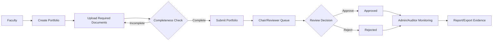
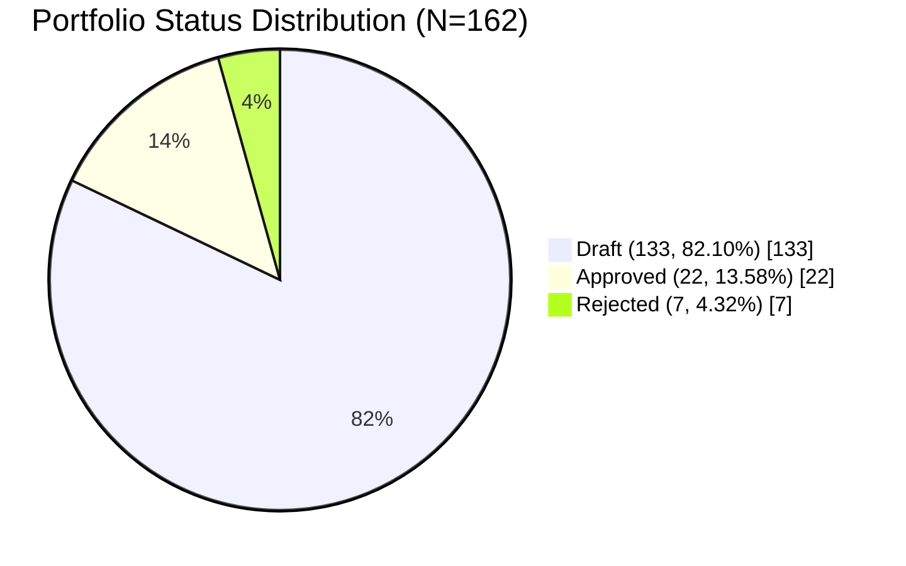
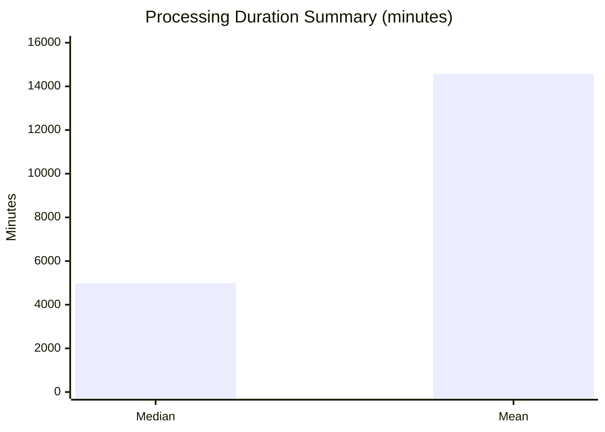
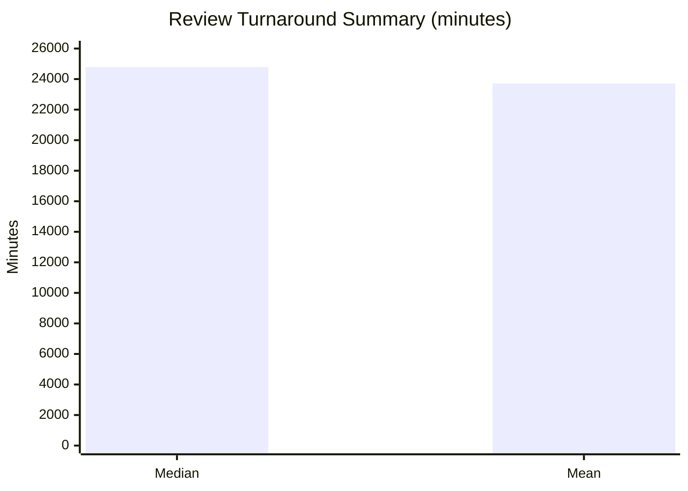
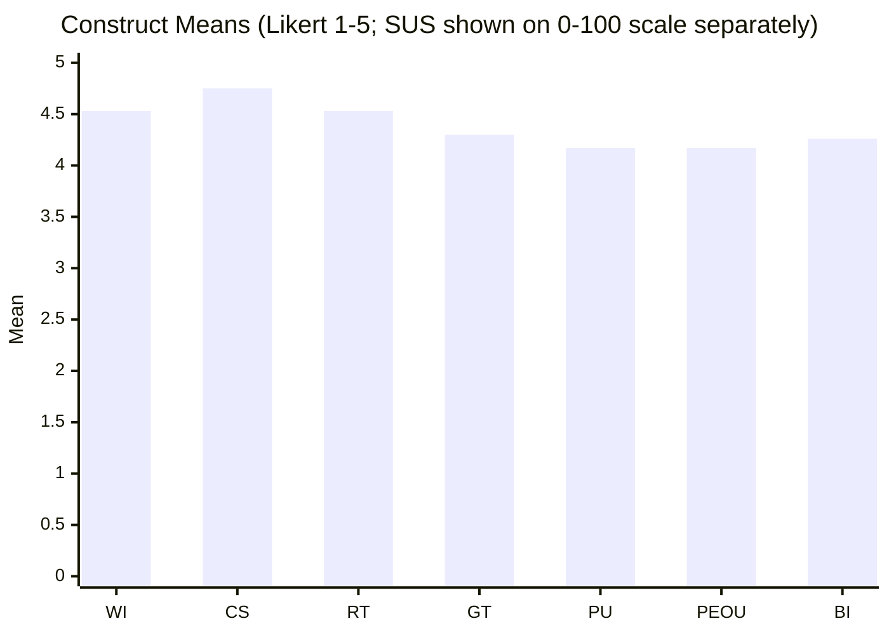
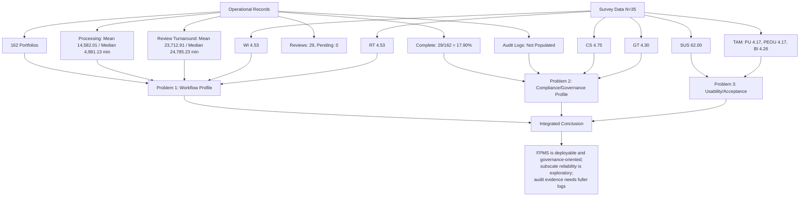

# FPMS Figures (Mermaid Source)

Use these Mermaid diagrams as source figures for your manuscript.  
Target filenames in Overleaf `figures/` are noted per figure.

---

## Figure 1: FPMS Role-Based Workflow Architecture
**Target file:** `fig01_fpms_workflow_architecture.png`

---

## Figure 2: Portfolio Status Distribution
**Target file:** `fig02_fpms_status_distribution.png`

---

## Figure 3: Processing Duration Summary
**Target file:** `fig03_fpms_processing_time_boxplot.png`

---

## Figure 4: Review Turnaround Summary
**Target file:** `fig04_fpms_review_turnaround_boxplot.png`

---

## Figure 5: Construct Means (Survey)
**Target file:** `fig05_fpms_construct_means.png`

---

## Figure 6: Results Flow (Operational + Survey to Findings)
**Target file:** `fig06_fpms_results_flow.png`

