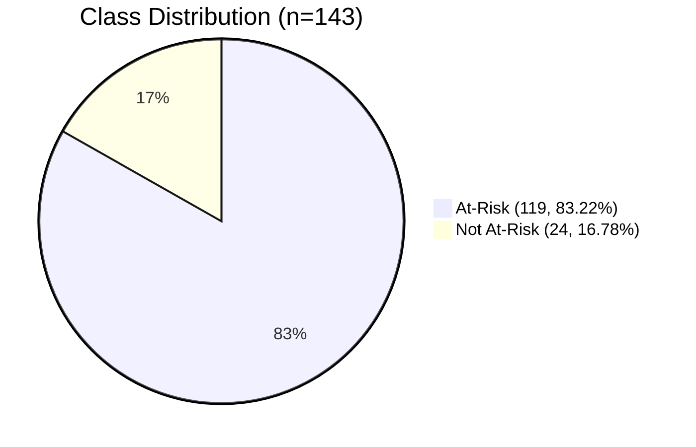
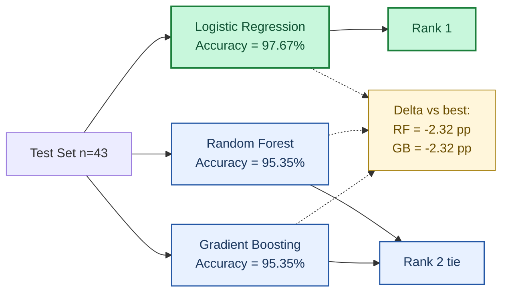
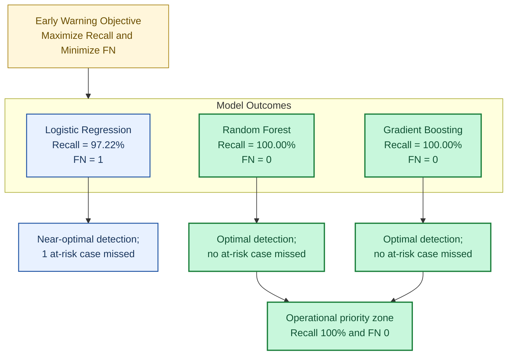
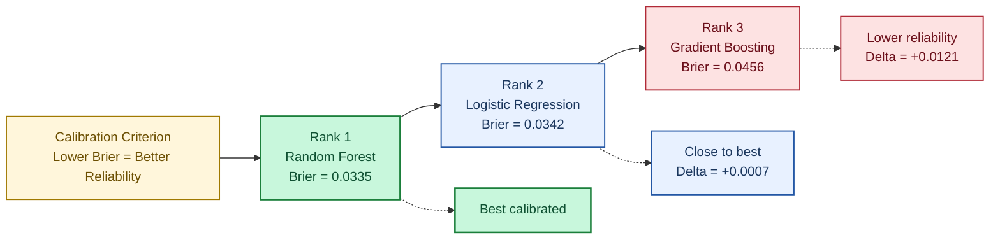
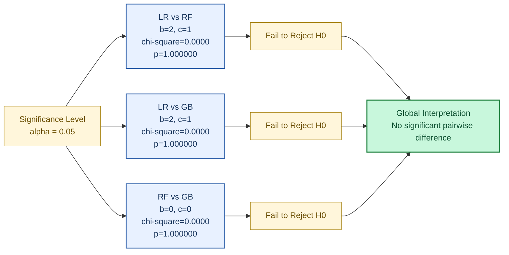

# CHAPTER IV DIAGRAMS (MERMAID)

Use the following diagrams as insertion-ready figures for Chapter IV.

## Figure 4.1. Chapter IV Experimental Pipeline

```mermaid
flowchart LR
    A[Raw Faculty Portfolio Records<br/>n=143] --> B[Data Preparation<br/>Cleaning + Feature Engineering]
    B --> C[Time-Aware Split<br/>Train=100 | Test=43]
    C --> D1[Logistic Regression]
    C --> D2[Random Forest]
    C --> D3[Gradient Boosting]
    D1 --> E[Model Evaluation]
    D2 --> E
    D3 --> E
    E --> F[Metrics<br/>Accuracy, Precision, Recall, F1, ROC-AUC, PR-AUC]
    E --> G[Reliability<br/>Brier Score]
    E --> H[Statistical Comparison<br/>McNemar Test]
    F --> I[Deployment-Oriented Selection]
    G --> I
    H --> I
    I --> J[Selected Model: Random Forest]
```

## Figure 4.2. Class Distribution of Final Dataset



## Figure 4.3. Test-Set Accuracy Comparison



## Figure 4.4. Recall and False Negative Trade-off



## Figure 4.5. Brier Score (Calibration Reliability)



## Figure 4.6. McNemar Pairwise Significance Results


